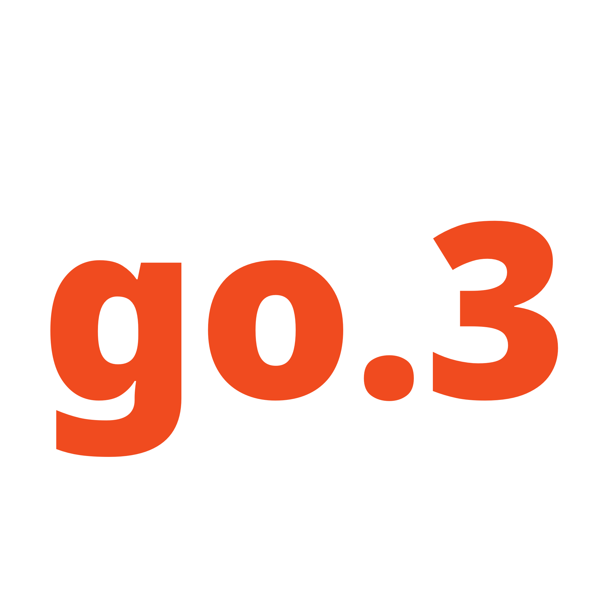

 

  
  <h3 align="center">go.3</h3>

  

    go.3 is the successor of goPage.
     
    <a href="https://go3.mmmarco.de/"><strong>Use now »</strong></a>
     
  

## About The Project

go.3 is the successor of goPage. 
Now it's build like goPage but some big changes happened. 
goPage was built on top of ePage. So now: 0.1 ePage -> 1.0 goPage -> ...
-> 2.1 goPage -> (3.0) "go.3". 
Made with HTML, CSS and a bit of JavaScript.

## Getting Started

To get started open go.3 in a browser tab and click on the search variant you want to use. Than copy the URL of the site with the searchbar to the search engine of your choice. Then open your browser settings and set the URL to the new tab homepage URL.
